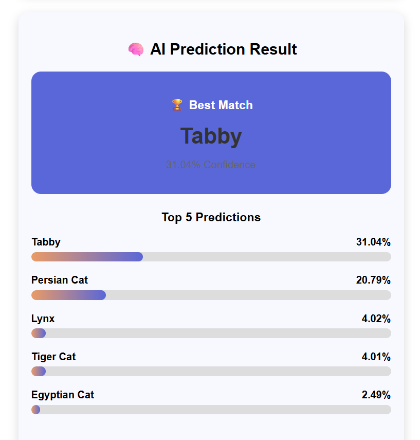
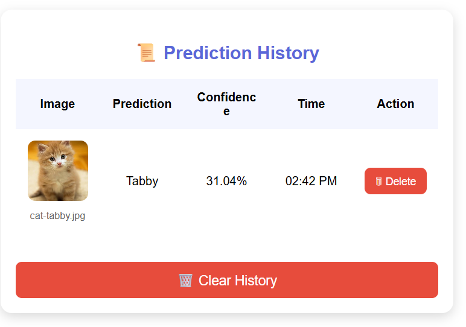
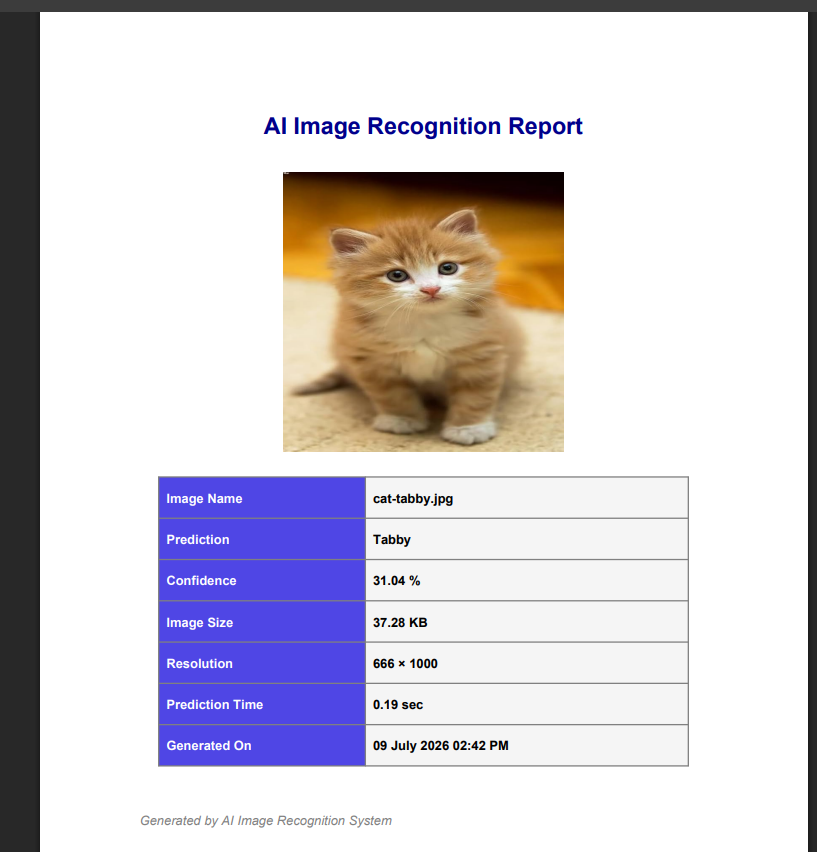

# 🖼️ AI Image Recognition System

An AI-powered Image Recognition System built using Flask and TensorFlow (MobileNetV2).

## 🚀 Features

- Upload Image
- Drag & Drop Upload
- AI Image Recognition
- Top 5 Predictions
- Confidence Score
- Image Details
- Prediction Time
- Prediction History
- PDF Report Download
- Responsive UI

## 🛠 Technologies Used

- Python
- Flask
- TensorFlow
- MobileNetV2
- HTML
- CSS
- JavaScript
- ReportLab

## 📂 Project Structure

```
Image-Recognition-System/
│
├── app.py
├── predict.py
├── pdf_report.py
├── requirements.txt
│
├── static/
│   ├── css/
│   ├── js/
│   └── uploads/
│
├── templates/
│   └── index.html
│
└── README.md
```

## ▶️ How to Run

```bash
pip install -r requirements.txt
```

```bash
python app.py
```

Open:

```
http://127.0.0.1:5000
```

## 📸 Features Preview

### 🏠 Home Page


### 🧠 Prediction Result



### 📜 Prediction History



### 📄 PDF Report



## 👩‍💻 Developed By

Manisha Shah